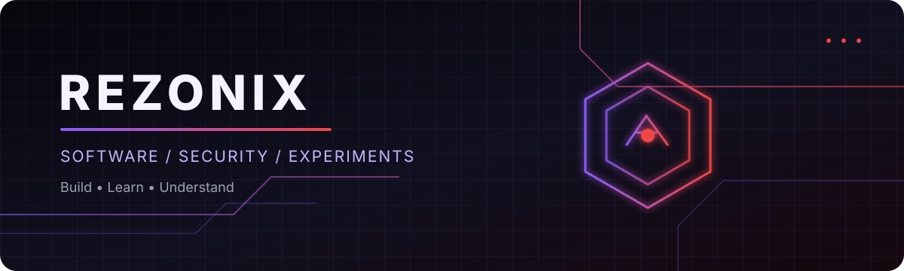

# REZONIX

### Software Developer in Progress · توسعه‌دهنده نرم‌افزار در مسیر یادگیری

[English](#english) · [فارسی](#فارسی)

---

## English

### About

Hi, I'm **Reza** — an aspiring software developer interested in building useful applications and understanding how software works under the hood.

I learn by experimenting, building projects, reading documentation, and improving through practical work. This profile is a record of that process: real projects, experiments, and lessons learned.

- 📱 Exploring **Android development**
- 🌐 Building for the **web**
- 🛡️ Learning **application security** and ethical reverse engineering
- 🧠 Experimenting with **AI-powered tools and integrations**
- 🧪 Practicing with **Python, JavaScript, and PHP**

### Focus

| Area | What I'm exploring |
|---|---|
| Android | App structure, UI, APIs, debugging, and release workflows |
| Web development | HTML, CSS, JavaScript, PHP, and backend fundamentals |
| Cybersecurity | Secure coding, basic testing, and defensive security concepts |
| Reverse engineering | Understanding app behavior in authorized labs and apps I own or have permission to analyze |
| AI | Integrating model APIs and building practical AI features |
| Python | Scripting, automation, and learning core programming concepts |

### Tech stack

**Currently exploring** — this is a learning map, not a claim of professional mastery.

`Android` · `Kotlin` · `Python` · `JavaScript` · `PHP` · `HTML` · `CSS` · `Git` · `GitHub`

### Featured projects

> Replace these example entries with real repositories as you publish them. Don't pin empty or unfinished repositories just to fill space.

- **Android Lab** — small Android experiments, documented with setup steps and screenshots.
- **Web Portfolio** — personal website and selected web projects.
- **Python Utilities** — small scripts with clear examples and tests.
- **App Security Notes** — ethical, defensive learning notes and lab write-ups.
- **AI Experiments** — small, reproducible demos for AI API integrations.

### What you'll find here

- Small projects that solve a clear problem
- Experiments with notes about what worked and what didn't
- Setup instructions so projects are easier to reproduce
- Honest progress rather than inflated skill claims

### Connect

- GitHub: `https://github.com/YOUR_GITHUB_USERNAME`
- Portfolio: **Add your live portfolio URL**
- Email: **Add a public contact email only if you want to receive messages**

---

## فارسی

### درباره من

سلام، من **رضا** هستم؛ توسعه‌دهنده‌ای در مسیر یادگیری که به ساخت نرم‌افزارهای کاربردی و فهمیدن سازوکار داخلی برنامه‌ها علاقه دارد.

با ساخت پروژه، آزمایش، مطالعه مستندات و اصلاح اشتباهات یاد می‌گیرم. این پروفایل قرار است مسیر واقعی یادگیری من را نشان بدهد: پروژه‌ها، آزمایش‌ها و چیزهایی که در عمل یاد می‌گیرم.

- 📱 یادگیری توسعه اپلیکیشن اندروید
- 🌐 ساخت وب‌سایت و برنامه‌های تحت وب
- 🛡️ یادگیری امنیت اپلیکیشن و مهندسی معکوس اخلاقی
- 🧠 آزمایش ابزارها و قابلیت‌های مبتنی بر هوش مصنوعی
- 🧪 تمرین با Python، JavaScript و PHP

### حوزه‌های تمرکز

| حوزه | مواردی که بررسی می‌کنم |
|---|---|
| اندروید | ساختار اپ، رابط کاربری، API، دیباگ و فرایند انتشار |
| توسعه وب | HTML، CSS، JavaScript، PHP و مبانی بک‌اند |
| امنیت سایبری | کدنویسی امن، تست‌های پایه و مفاهیم دفاعی امنیت |
| مهندسی معکوس | بررسی رفتار برنامه‌ها در محیط آزمایشگاهی مجاز و اپ‌هایی که مالک آن‌ها هستم یا اجازه تحلیلشان را دارم |
| هوش مصنوعی | اتصال API مدل‌ها و ساخت قابلیت‌های کاربردی |
| پایتون | اسکریپت‌نویسی، خودکارسازی و تمرین مفاهیم اصلی برنامه‌نویسی |

### فناوری‌ها

**در حال یادگیری و آزمایش** — این فهرست نقشه مسیر یادگیری است، نه ادعای تسلط حرفه‌ای.

`Android` · `Kotlin` · `Python` · `JavaScript` · `PHP` · `HTML` · `CSS` · `Git` · `GitHub`

### پروژه‌های منتخب

> وقتی مخزن‌های واقعی آماده شدند، این بخش را با لینک و توضیح دقیق هر پروژه به‌روزرسانی کن.

- **Android Lab** — آزمایش‌های کوچک اندروید همراه با راه‌اندازی و تصویر.
- **Web Portfolio** — وب‌سایت شخصی و پروژه‌های منتخب وب.
- **Python Utilities** — اسکریپت‌های کوچک با مثال و تست.
- **App Security Notes** — یادداشت‌های یادگیری امنیت دفاعی و گزارش آزمایشگاه‌های مجاز.
- **AI Experiments** — نمونه‌های کوچک و قابل اجرا برای اتصال به APIهای هوش مصنوعی.

### چه چیزهایی در این پروفایل می‌بینی؟

- پروژه‌هایی با هدف مشخص
- آزمایش‌ها و توضیح نتیجه‌ها، حتی وقتی جواب نمی‌دهند
- راهنمای اجرا برای بازتولید پروژه‌ها
- پیشرفت واقعی، بدون بزرگ‌نمایی مهارت‌ها

### ارتباط

- گیت‌هاب: `https://github.com/rezonix-dl`
- وب‌سایت شخصی: **https://staticfile-lilrezo.wasmer.app/**
- ایمیل: **rezonixdl@gmail.com**

---

Built with curiosity. Improved through practice. · ساخته‌شده با کنجکاوی، بهترشده با تمرین.

